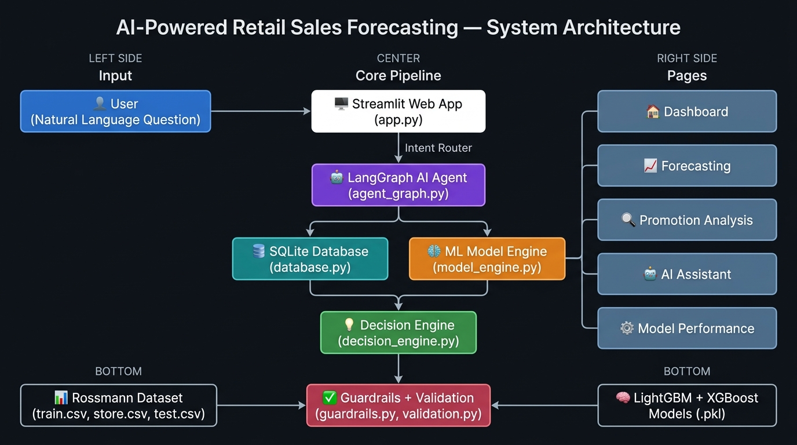

# 🏗 System Architecture — Retail AI Decision Intelligence Platform

> **Document owner:** Parvat (Team Lead)
> **Last updated:** September 2026

---

## 1. High-Level Architecture

```
┌─────────────────────────────────────────────────────────────────────┐
│                        USER (Browser)                               │
│   Types a question  ──or──  Speaks via microphone 🎤               │
└────────────────────────────┬────────────────────────────────────────┘
                             │  HTTP / WebSocket
                             ▼
┌─────────────────────────────────────────────────────────────────────┐
│                    Streamlit Web App  (app.py)                      │
│                                                                     │
│  ┌──────────┐ ┌───────────┐ ┌──────────┐ ┌────────┐ ┌──────────┐  │
│  │Dashboard │ │Forecasting│ │Promotion │ │AI Chat │ │ Model    │  │
│  │ Page 1   │ │  Page 2   │ │ Page 3   │ │ Page 4 │ │ Perf. 5  │  │
│  └──────────┘ └───────────┘ └──────────┘ └───┬────┘ └──────────┘  │
└──────────────────────────────────────────────┼─────────────────────┘
                                               │ run_agent()
                                               ▼
┌─────────────────────────────────────────────────────────────────────┐
│                   AI Agent Layer  (src/)                            │
│                                                                     │
│  query_understanding.py ── intent + entity extraction               │
│           │                                                         │
│  guardrails.py ──────────── scope check (retail only)              │
│           │                                                         │
│  agent_graph.py (LangGraph)                                         │
│      Router Node → [Data Analyst | Forecast | Decision | What-If]  │
│           │                                                         │
│  decision_engine.py ───── Obs / Prediction / Evidence / Rec        │
│           │                                                         │
│  response_validation.py ── grounding check before display          │
└──────────┬───────────────────────────────────────────────┬─────────┘
           │ SQL queries                                   │ model calls
           ▼                                               ▼
┌──────────────────────┐                    ┌─────────────────────────┐
│  src/database.py     │                    │  src/model_engine.py    │
│  SQLAlchemy + SQLite │                    │  LightGBM + XGBoost     │
│  data/retail.db      │                    │  models/*.pkl           │
└──────────────────────┘                    └─────────────────────────┘
           ▲                                               ▲
           │                                               │
┌──────────────────────┐                    ┌─────────────────────────┐
│ src/data_pipeline.py │                    │ src/feature_engineering │
│ train.csv + store.csv│                    │  Lags, rolling, promo   │
│ → retail.db          │                    │  flags, clustering      │
└──────────────────────┘                    └─────────────────────────┘
```

---

## 2. System Architecture Diagram



---

## 3. Module Responsibility Map

| Module | Owner | Responsibility |
|--------|-------|---------------|
| `app.py` | Parvat | Streamlit shell, page navigation, sidebar |
| `config.py` | Parvat | All file paths and environment flags (single source of truth) |
| `src/data_pipeline.py` | Himanshu | ETL: cleans raw CSVs, runs feature engineering, writes `retail.db` |
| `src/database.py` | Himanshu | **All** SQL queries — no other file writes SQL |
| `src/feature_engineering.py` | Ashutosh + Himanshu | Lag columns, rolling stats, promo streak, store clustering |
| `src/model_engine.py` | Ashutosh | `get_7day_forecast()`, `get_shap_explanations()`, `get_whatif_forecast()`, `get_model_metrics()`, `get_baseline_comparison()` |
| `src/agent_graph.py` | Saumya | LangGraph graph: Router → Data Analyst → Forecast → Decision → What-If nodes |
| `src/decision_engine.py` | Saumya | Builds the 4-section structured response from raw tool results |
| `src/prompts.py` | Saumya | System prompt, store-type descriptions, tool descriptions |
| `src/query_understanding.py` | Saumya | Intent classification (`forecast`, `recommend`, `whatif`, `out_of_scope`, …) and entity extraction (store IDs) |
| `src/guardrails.py` | Saumya | Blocks out-of-scope queries before the LLM runs |
| `src/validation.py` | Saumya | Validates agent input/output structure |
| `src/response_validation.py` | Saumya | Ensures response is grounded before display |
| `components/charts.py` | Dikshit | Shared Plotly chart builder functions |
| `components/ui_helpers.py` | Dikshit | `kpi_card()`, `section_header()`, `citation_card()`, `show_empty_state()` |
| `pages/1_🏠_Dashboard.py` | Dikshit | Fleet analytics, health score, alerts, anomaly detection |
| `pages/2_📈_Forecasting.py` | Dikshit + Ashutosh | 7-day forecast, SHAP, confidence meter, promo calendar |
| `pages/3_🔍_Promotion_Analysis.py` | Dikshit | Uplift ranking, type breakdown, store deep-dive |
| `pages/4_🤖_AI_Assistant.py` | Dikshit + Saumya | Streaming chat, voice input, response time badge |
| `pages/5_⚙️_Model_Performance.py` | Dikshit + Ashutosh | RMSPE/MAE/R² cards, CV diagram, comparison chart |

---

## 4. LangGraph Agent — Node Design

```
                     ┌───────────┐
    User Query  ──►  │  Router   │  (intent: forecast / recommend / whatif / performance / out_of_scope)
                     └─────┬─────┘
              ┌────────────┼─────────────┬──────────────┐
              ▼            ▼             ▼              ▼
      ┌───────────┐  ┌──────────┐  ┌─────────┐  ┌───────────┐
      │   Data    │  │ Forecast │  │What-If  │  │  OOS      │
      │ Analyst   │  │  Node    │  │  Node   │  │ Blocker   │
      └─────┬─────┘  └────┬─────┘  └────┬────┘  └───────────┘
            │             │             │
            └──────┬───────┘             │
                   ▼                     │
           ┌──────────────┐             │
           │   Decision   │◄────────────┘
           │    Node      │
           └──────┬───────┘
                  │
           ┌──────▼───────┐
           │  Response    │
           │  Validation  │
           └──────┬───────┘
                  │
           Streamed to UI
```

### Node Inputs / Outputs

| Node | Input | Output |
|------|-------|--------|
| **Router** | Raw user query | Intent label + extracted store IDs |
| **Data Analyst** | Store IDs + date range | Historical sales, promo history, anomalies |
| **Forecast** | Store IDs | 7-day LightGBM forecast + SHAP values |
| **What-If** | Store ID + promo flag | Forecast under promo / no-promo conditions |
| **Decision** | All tool results | Structured 4-section response + citations |
| **OOS Blocker** | Out-of-scope query | Friendly refusal message |

---

## 5. Data Flow — End-to-End

```
data/train.csv  ──┐
data/store.csv  ──┤──► src/data_pipeline.py ──► data/retail.db (SQLite)
                  │         │
                  │     feature_engineering.py (lags, rolling, promo flags)
                  │
                  └──► src/model_engine.py
                              │  compare_models.py (training)
                              ▼
                    models/lgbm_model.pkl
                    models/xgboost_model.pkl
                    models/shap_explainer.pkl
                    models/impute_medians.pkl
                    models/metrics.json           ← used by Model Performance page
```

---

## 6. New Features Added (Post-Initial-Build)

| Feature | Page | Implementation |
|---------|------|---------------|
| 🎤 Live voice input | AI Assistant | `streamlit-mic-recorder`, feeds `pending_query` state |
| ⚡ Response time badge | AI Assistant | Stored in session state per message, color-coded pill |
| 🎯 Animated confidence meter | Forecasting | CSS keyframe animation, computed from LowerBound/UpperBound width |
| 🎯 Forecast accuracy badge | Forecasting | 5th KPI card, `1 - RMSPE %` |
| 🏆 Best promotion day calendar | Forecasting | 7-day heat strip from `get_whatif_forecast()` |
| 🩺 Fleet Health Score | Dashboard | SVG ring gauge, model accuracy × 0.6 + promo uplift × 0.4 |
| 📉 Worst Day of the Week | Dashboard | Direct SQL `GROUP BY DayOfWeek ORDER BY AVG(Sales) ASC LIMIT 1` |
| 🔔 Sales Drop Alert simulation | Dashboard | Streamlit widgets + `st.success` toast |
| 🐳 Docker setup | Root | `Dockerfile` + `docker-compose.yml` + `.dockerignore` |
| 📖 CONTRIBUTING.md | Root | 8-step guide for adding new store types |

---

## 7. Database Schema

The actual `retail.db` is a **single denormalised `sales` table** (store metadata joined at pipeline time):

### Table: `sales`

| Column | Type | Description |
|--------|------|-------------|
| `Store` | INTEGER | Store number (1–1115) |
| `DayOfWeek` | INTEGER | 1=Mon … 7=Sun |
| `Date` | TEXT | YYYY-MM-DD |
| `Sales` | REAL | Daily sales (€) |
| `Customers` | INTEGER | Daily footfall |
| `Open` | INTEGER | 1=Open, 0=Closed |
| `Promo` | INTEGER | 1=Promo active |
| `StateHoliday` | TEXT | "0", "a", "b", "c" |
| `SchoolHoliday` | INTEGER | 1=School holiday |
| `StoreType` | TEXT | "a", "b", "c", "d" |
| `Assortment` | TEXT | "a", "b", "c" |
| `CompetitionDistance` | REAL | Metres to nearest competitor |
| `Promo2` | INTEGER | 1=Running continuous promo |
| `Year`, `Month`, `Day` | INTEGER | Calendar breakdowns |
| `WeekOfYear`, `Quarter` | INTEGER | Period fields |
| `IsWeekend` | INTEGER | 1 if Sat/Sun |
| `Sales_lag_7/14/28` | REAL | Lagged sales (no data leakage) |
| `Sales_roll_mean_7/14/28` | REAL | Rolling averages |
| `Sales_roll_std_7/14` | REAL | Rolling standard deviation |
| `CompetitionOpenMonths` | REAL | How long competitor has been open |
| `IsPromo2Active` | INTEGER | Derived from Promo2 + PromoInterval |
| `PromoStreak` | INTEGER | Consecutive promo days |
| `DaysSinceLastPromo` | REAL | Recency of last promotion |
| `DaysUntilNextPromo` | REAL | Days to next known promo |
| `store_cluster` | INTEGER | KMeans cluster ID |
| `sales_zscore` | REAL | Z-score for anomaly detection |
| `is_anomaly` | INTEGER | 1 if \|z-score\| > 2.5 |

**Indexes:** `(Store)`, `(Date)`, `(Store, Date)`, `(Promo)`, `(StoreType)`

---

## 8. API Contracts

### `src/database.py`

```python
get_store_metrics(store_ids: list[int], days: int = 30) -> pd.DataFrame
# columns: [Store, Date, Sales, Customers, Promo]

get_promo_history(store_id: int) -> dict
# {promo_avg_sales, non_promo_avg_sales, uplift_pct, promo_days, non_promo_days}

get_eda_summary() -> dict
# {total_stores, avg_daily_sales, total_sales, best_store_id, worst_store_id, ...}

get_sales_trend(store_id: int, period: str = "monthly") -> pd.DataFrame
# columns: [period, avg_sales, total_sales]

get_all_stores() -> pd.DataFrame
# columns: [Store, StoreType, Assortment, CompetitionDistance]

get_promo_uplift_ranking(top_n: int = 10) -> pd.DataFrame
# columns: [Store, uplift_pct, store_type]

get_anomaly_flags(store_id: int, lookback_days: int = 90) -> pd.DataFrame
# columns: [date, sales, is_anomaly, sales_zscore]

get_store_sales_ranking(top_n: int = 10, ascending: bool = False) -> pd.DataFrame
# columns: [Store, avg_sales]
```

### `src/model_engine.py`

```python
get_7day_forecast(store_id: int) -> pd.DataFrame
# 7 rows, columns: [Date, PredictedSales, LowerBound, UpperBound]

get_shap_explanations(store_id: int) -> dict
# {feature_name: {"value": float, "direction": "positive"|"negative"}}

get_shap_waterfall_data(store_id: int) -> dict
# {date, base_value_sales, predicted_sales, features: [{name, shap_value}, ...]}

get_model_metrics() -> dict
# {lightgbm: {rmspe, mae, r2, folds: [...]}, xgboost: {...}, primary_model: "lightgbm"}

get_baseline_comparison(store_id: int) -> pd.DataFrame
# columns: [Date, LightGBM, XGBoost, Baseline_MovingAvg]

get_whatif_forecast(store_id: int, promo_override: bool) -> pd.DataFrame
# 7 rows, columns: [Date, PredictedSales, LowerBound, UpperBound]

get_forecast_calendar(store_id: int) -> pd.DataFrame
# columns: [Date, Open, Promo, DayOfWeek]
```

### `src/agent_graph.py`

```python
run_agent(user_query: str, session_id: str = "default") -> str
# Returns: markdown string with Obs/Pred/Evidence/Rec/Sources

progress_reporting(on_stage: Callable, on_draft: Callable) -> ContextManager
# Context manager that pushes stage labels and draft text to queues

reset_session(session_id: str) -> None
# Clears the agent's conversation memory for this session
```

### `src/decision_engine.py`

```python
generate_decision_report(store_id: int) -> dict
# {observation, prediction, evidence, recommendation, risk_level, data_sources}

compare_stores_report(store_ids: list[int]) -> dict
# {ranked_stores: [{store_id, rank, score, recommendation}], summary}
```

---

## 9. Security & Reliability Decisions

| Decision | Implementation |
|----------|---------------|
| **API key safety** | `OPENROUTER_API_KEY` in `.env` (gitignored); loaded via `python-dotenv` |
| **No SQL injection** | All queries use SQLAlchemy parameterised statements |
| **No model loading in UI** | `.pkl` files loaded only inside `model_engine.py`, never in pages |
| **Agent error handling** | All agent calls wrapped in `try/except`; errors show friendly UI message |
| **Guardrails** | `guardrails.py` blocks out-of-scope queries before LLM runs |
| **Response validation** | `response_validation.py` checks grounding before display |
| **Cache** | `@st.cache_data(ttl=3600)` on all DB-fetching functions |
| **Gitignore** | `retail.db`, `*.pkl`, `.env`, `__pycache__/` all excluded |

---

## 10. Import Dependency Graph

```
config.py
    ← imported by: all src/ modules, all pages/

src/data_pipeline.py
    ← imports: feature_engineering, config
    ← run once: python src/data_pipeline.py

src/database.py
    ← imports: sqlalchemy, config
    ← imported by: agent_graph, pages/ (via cached wrappers)

src/feature_engineering.py
    ← imports: pandas, numpy
    ← imported by: data_pipeline

src/model_engine.py
    ← imports: lightgbm, xgboost, shap, joblib, database, config
    ← imported by: agent_graph, pages/2, pages/5

src/query_understanding.py
    ← imports: langchain-core, config
    ← imported by: agent_graph

src/guardrails.py
    ← imports: nothing external
    ← imported by: agent_graph

src/prompts.py
    ← imports: nothing
    ← imported by: agent_graph

src/agent_graph.py
    ← imports: langgraph, langchain, database, model_engine,
               decision_engine, prompts, guardrails, query_understanding, config
    ← imported by: pages/4

src/decision_engine.py
    ← imports: database, model_engine, config
    ← imported by: agent_graph

components/charts.py
    ← imports: plotly, pandas
    ← imported by: all pages

components/ui_helpers.py
    ← imports: streamlit
    ← imported by: all pages
```

**Circular import rule:** No module may import from a module that imports back from it.

---

## 11. Known Limitations & Future Improvements

### Current Limitations

| Limitation | Impact | Workaround |
|------------|--------|-----------|
| Dataset ends July 2015 | Forecasts relative to training end, not real-time | Frame as "simulated forecasting" in presentation |
| SQLite concurrency | Single write at a time | Acceptable for local demo |
| 7-day forecast horizon | Unreliable beyond 7 days | Feature set would need longer-lag features |
| LLM latency (OpenRouter) | 5–20s per response | Streaming + progress indicators handle UX |
| Voice input browser support | Mic prompt required; best in Chrome | Documented in CONTRIBUTING.md |

### Future Improvements

| Improvement | Effort | Benefit |
|-------------|--------|---------|
| Real-time POS data ingestion | High | Actual live forecasting |
| Store-level hyperparameter tuning | Medium | Better per-store RMSPE |
| Prophet model for annual seasonality | Medium | Better holiday handling |
| RAG over promo policy documents | Medium | Cited strategy recommendations |
| Cloud deployment (GCP / AWS) | High | Production scalability |
| Multi-user session management | High | Team-wide access |

---

*Document maintained by: Parvat (Team Lead)*
*Visual diagram: `docs/architecture_diagram.jpg`*
*All Mermaid diagrams render in GitHub and compatible markdown viewers.*
