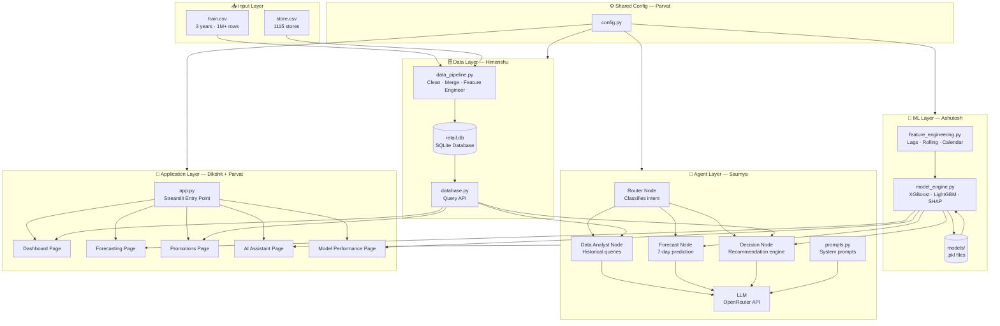
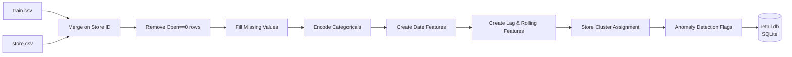
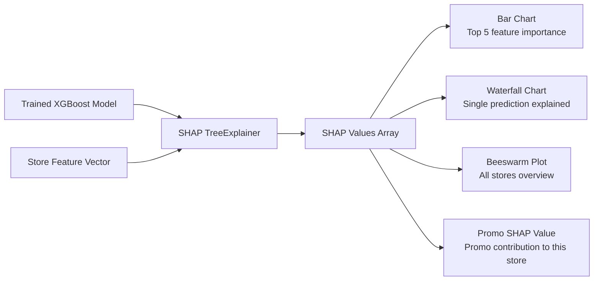
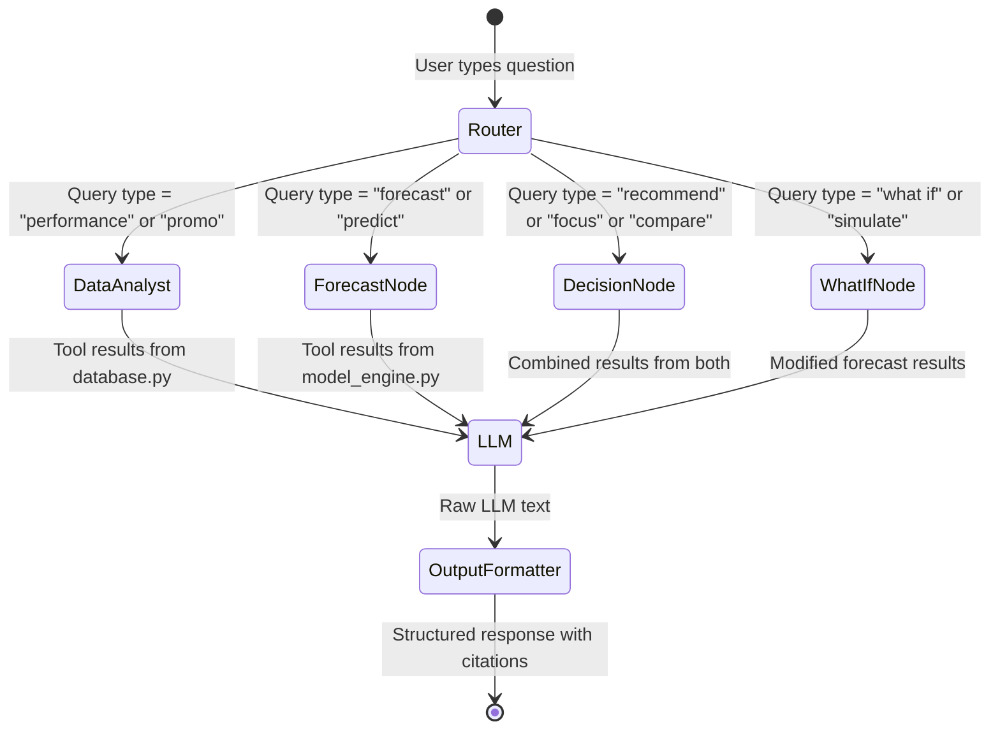

# 🏛️ Master Architecture Document
## Retail AI — Sales Forecasting & Decision Intelligence Platform

> **Version:** 1.0 | **Authors:** Parvat (Lead) + Team | **Status:** Reference Document

---

## Table of Contents

1. [System Overview](#1-system-overview)
2. [High-Level Architecture Diagram](#2-high-level-architecture-diagram)
3. [Layer-by-Layer Breakdown](#3-layer-by-layer-breakdown)
4. [Data Architecture](#4-data-architecture)
5. [Machine Learning Architecture](#5-machine-learning-architecture)
6. [Agentic AI Architecture](#6-agentic-ai-architecture)
7. [Application Architecture](#7-application-architecture)
8. [Full Request Flow — Step by Step](#8-full-request-flow--step-by-step)
9. [Technology Stack & Why We Chose It](#9-technology-stack--why-we-chose-it)
10. [File Dependency Map](#10-file-dependency-map)
11. [Data Model (SQLite Schema)](#11-data-model-sqlite-schema)
12. [API Contract Summary](#12-api-contract-summary)
13. [Security & Reliability Decisions](#13-security--reliability-decisions)
14. [Known Limitations & Future Improvements](#14-known-limitations--future-improvements)

---

## 1. System Overview

### What This System Does

The platform allows a retail store manager to:

- **See** how their stores are performing (dashboards, EDA)
- **Forecast** expected sales over the next 7 days for any store
- **Understand** what is driving those sales (SHAP explainability)
- **Ask** natural-language questions and get grounded, evidence-backed answers
- **Receive** structured business recommendations (Observation → Prediction → Evidence → Recommendation)

### The Core Framework

```
ANALYZE  →  PREDICT  →  EXPLAIN  →  RECOMMEND
  (EDA)   (XGBoost)    (SHAP)     (Decision Engine)
```

### Guiding Architecture Principles

| Principle | How We Apply It |
|-----------|----------------|
| **Local-first** | Everything runs on a laptop — no cloud APIs required (except optional LLM via OpenRouter) |
| **Modular** | 4 isolated Python modules; each developer owns one clean interface |
| **Grounded AI** | LLM never generates numbers — all figures come from tool calls to real data |
| **Mock-first** | Mocks allow parallel development from Day 1 without blocking |
| **Testable** | Every module has its own test file; a curveball stress test validates the whole system |

---

## 2. High-Level Architecture Diagram



---

## 3. Layer-by-Layer Breakdown

The system is divided into **4 horizontal layers**. Each layer is independent and communicates only through defined function contracts.

```
┌─────────────────────────────────────────────────────────────────┐
│  LAYER 4: APPLICATION LAYER                                     │
│  Streamlit (app.py + 5 pages)          ← Dikshit + Parvat         │
│  What the user sees and interacts with                          │
├─────────────────────────────────────────────────────────────────┤
│  LAYER 3: INTELLIGENCE LAYER                                    │
│  LangGraph Agent + Decision Engine     ← Saumya                  │
│  Understands questions, routes, calls tools, builds answers     │
├────────────────────────┬────────────────────────────────────────┤
│  LAYER 2a: ML LAYER    │  LAYER 2b: DATA LAYER                  │
│  model_engine.py       │  database.py                           │
│  ← Ashutosh               │  ← Himanshu                               │
│  Forecasts + SHAP      │  Historical queries + EDA              │
├────────────────────────┴────────────────────────────────────────┤
│  LAYER 1: STORAGE LAYER                                         │
│  retail.db (SQLite)  +  models/*.pkl                            │
│  What the data and models are stored in                         │
└─────────────────────────────────────────────────────────────────┘
```

### Layer Communication Rules

- **Layer 4 → Layer 3:** `app.py` calls only `run_agent_stream()` for AI queries
- **Layer 4 → Layer 2a/2b:** Pages call only functions from `database.py` and `model_engine.py`
- **Layer 3 → Layer 2a/2b:** Agent tools call `database.py` and `model_engine.py` functions
- **Layer 2 → Layer 1:** `database.py` uses SQLAlchemy; `model_engine.py` loads `.pkl` files
- **No layer may skip a layer** — e.g., `app.py` must never open `retail.db` directly

---

## 4. Data Architecture

### 4.1 Raw Data Sources

| File | Rows | Key Columns | Used For |
|------|------|------------|----------|
| `train.csv` | ~1,017,209 | Store, Date, Sales, Customers, Open, Promo, StateHoliday, SchoolHoliday | All sales analysis and model training |
| `store.csv` | 1,115 | StoreType, Assortment, CompetitionDistance, CompetitionOpenSince, Promo2 | Store characteristics, competition analysis |

### 4.2 Data Pipeline Flow



### 4.3 Data Cleaning Decisions

| Problem | Decision | Why |
|---------|----------|-----|
| `CompetitionDistance` nulls (~354 rows) | Fill with dataset median | Most likely very far away; median is safer than mean |
| `CompetitionOpenSinceMonth/Year` nulls | Fill with 0 → `CompetitionAgeMonths = 0` | Indicates unknown/no nearby competition |
| `PromoInterval` nulls | Fill with `"None"` | No extended promotion; encode as binary 0 |
| Rows where `Open == 0` | Remove before model training | Sales always 0 when closed; would bias model |
| `StateHoliday` values `0` and `"0"` | Normalise both to `"0"` | Mixed types cause groupby errors |
| `Sales == 0` on open days | Keep in EDA; remove from RMSPE calculation | Unusual but valid; RMSPE undefined at 0 |

### 4.4 Feature Engineering

#### Time Features (from Date column)
| Feature | Description |
|---------|-------------|
| `Year`, `Month`, `Week`, `DayOfYear` | Calendar decomposition |
| `DayOfWeek` | 0=Monday … 6=Sunday |
| `IsWeekend` | Binary flag for Saturday/Sunday |
| `DaysToNextHoliday` | Days until next state holiday |
| `DaysAfterHoliday` | Days since last state holiday |

#### Lag Features (prevent data leakage — all use `.shift()`)
| Feature | Description |
|---------|-------------|
| `Sales_lag_7` | Sales 7 days ago |
| `Sales_lag_14` | Sales 14 days ago |
| `Sales_lag_28` | Sales 28 days ago |
| `Sales_lag_365` | Sales same day last year |

#### Rolling Window Features
| Feature | Description |
|---------|-------------|
| `Sales_rolling_mean_7` | 7-day rolling average |
| `Sales_rolling_mean_14` | 14-day rolling average |
| `Sales_rolling_std_7` | 7-day rolling standard deviation (volatility) |
| `Customers_rolling_mean_7` | 7-day customer count rolling average |

#### Competition Features
| Feature | Description |
|---------|-------------|
| `CompetitionAgeMonths` | Months since competition opened |
| `IsNewCompetitor` | Binary — competition opened in last 6 months |

#### Promotion Features
| Feature | Description |
|---------|-------------|
| `IsPromo2Active` | Whether Promo2 is currently active based on `PromoInterval` and date |
| `PromoWeek` | Days into the current promotion period |

---

## 5. Machine Learning Architecture

### 5.1 Forecasting Strategy

We use a **direct multi-step forecasting** approach: one model trained to predict `Sales` using lag features, meaning the same model is used 7 times with different future lag inputs to produce 7 daily predictions.

### 5.2 Model Comparison Pipeline

```
Input: Cleaned + Feature-Engineered Dataset
          │
          ▼
┌─────────────────────┐     ┌─────────────────────────────┐
│  Baseline Model     │     │  ML Models (Walk-Forward CV) │
│  7-day Moving Avg   │     │                             │
│  (no features)      │     │  1. Ridge Regression        │
│                     │     │  2. XGBoost ← (primary)     │
│  RMSPE: ~0.35       │     │  3. LightGBM ← (secondary)  │
└─────────────────────┘     └─────────────────────────────┘
                                         │
                                         ▼
                               Best model selected
                               based on RMSPE on
                               hold-out validation set
```

### 5.3 Walk-Forward Cross Validation

```
Time ──────────────────────────────────────────────────────────►

Fold 1:  [══════════Train══════════] [Validate]
Fold 2:  [══════════Train══════════════] [Validate]
Fold 3:  [══════════Train═══════════════════] [Validate]
Fold 4:  [══════════Train══════════════════════════] [Validate]
Fold 5:  [══════════Train═════════════════════════════] [Validate]

Each validate window = 7 days (one forecast horizon)
```

This prevents data leakage: the model is never trained on future data.

### 5.4 Evaluation Metric: RMSPE

```
RMSPE = sqrt( mean( ((actual - predicted) / actual)² ) )

Why RMSPE:
  - It is the official Rossmann Kaggle competition metric
  - Penalises percentage error equally for high-sales and low-sales stores
  - A store doing €500/day and a store doing €50,000/day are treated fairly
  - Lower is better; 0 = perfect; industry acceptable threshold ≈ 0.15–0.25
```

### 5.5 SHAP Explainability Pipeline



### 5.6 What-If Simulator

```
get_whatif_forecast(store_id=200, promo_override=True)
         │
         ▼
Take the store's feature vector for next 7 days
Set Promo = 1 (or 0) regardless of actual schedule
Run through XGBoost
Return the modified 7-day forecast
         │
         ▼
UI shows: "With promo: €12,450 avg/day" vs "Without: €9,870 avg/day"
         → Uplift: +26.1%
```

---

## 6. Agentic AI Architecture

### 6.1 Why We Use an Agent (Not a Simple RAG)

A standard RAG system retrieves documents and lets the LLM summarise them. Our system needs to:
- **Execute live computations** (run a forecast, query a database)
- **Route** different query types to different tools
- **Combine** multiple data sources into one structured answer
- **Guarantee grounding** — no number the LLM outputs should be invented

A LangGraph agent with tool-calling satisfies all these needs.

### 6.2 Agent Graph Design



### 6.3 The Four Agent Nodes

#### 🔀 Router Node
- **Input:** Raw user query string
- **What it does:** Classifies the query intent using keyword matching + LLM classification
- **Output:** Routes to one of 4 downstream nodes
- **Example:** "Which store should I focus on?" → `DecisionNode`

#### 📊 Data Analyst Node
- **Input:** Query + routing decision
- **Tools it calls:**
  - `get_store_metrics(store_ids, days)` ← from `database.py`
  - `get_promo_history(store_id)` ← from `database.py`
  - `get_sales_trend(store_id)` ← from `database.py`
- **Output:** Structured data dict passed to LLM with grounding context
- **Example query:** "How is Store 125 performing?"

#### 📈 Forecast Node
- **Input:** Query + store ID extracted from query
- **Tools it calls:**
  - `get_7day_forecast(store_id)` ← from `model_engine.py`
  - `get_shap_explanations(store_id)` ← from `model_engine.py`
  - `get_baseline_comparison(store_id)` ← from `model_engine.py`
- **Output:** Forecast data dict passed to LLM with grounding context
- **Example query:** "What are the expected sales for Store 100 next week?"

#### 🎯 Decision Node
- **Input:** Query + list of store IDs
- **What it does:** Calls `generate_decision_report()` or `compare_stores_report()` from `decision_engine.py` which internally fetches from both `database.py` and `model_engine.py`
- **Output:** Full Observation → Prediction → Evidence → Recommendation structure
- **Example query:** "Which of stores 100, 200, 300, 400, 500 should I focus on next week?"

#### 🔮 What-If Node *(S-Grade)*
- **Input:** Query + store ID + promo scenario
- **Tools it calls:**
  - `get_whatif_forecast(store_id, promo_override)` ← from `model_engine.py`
  - `get_promo_history(store_id)` ← for context
- **Output:** Comparison of current vs simulated forecast
- **Example query:** "What would happen to Store 200's sales if we added a promotion next week?"

### 6.4 Hallucination Prevention Design

```
Every agent response must cite a data source.
The LLM system prompt strictly prohibits generating numbers:

  "You are a retail analytics assistant.
   You may ONLY state sales figures, store IDs, percentages, and
   dates that appear in the tool results provided to you.
   If a figure is not in the tool results, say 'data not available'
   and do not estimate or guess.
   Always end with a [Sources] section listing which tools provided the data."
```

| Risk | Mitigation |
|------|-----------|
| LLM invents sales numbers | Tool-only data access; LLM receives data in context, not from memory |
| LLM recommends non-existent promo | Decision Engine builds recommendation from actual promo history |
| Inconsistent store rankings | `compare_stores_report()` computes rank deterministically; LLM just formats it |
| Random responses on repeated queries | `decision_engine.py` output is deterministic (same data = same rank) |

### 6.5 AgentState Schema

```python
class AgentState(TypedDict):
    query: str                    # Original user question
    intent: str                   # "performance" | "forecast" | "recommend" | "whatif"
    store_ids: list[int]          # Extracted store IDs from query
    tool_results: dict            # Raw data returned by tool calls
    decision_report: dict         # Structured output from decision_engine
    response: str                 # Final formatted response for the user
    data_sources: list[str]       # Citation list for UI citation cards
    session_id: str               # For conversation memory
    error: str | None             # Error message if something fails
```

---

## 7. Application Architecture

### 7.1 Streamlit Multi-Page Layout

```
localhost:8501
│
├── app.py              ← Entry point; sets page config, sidebar, shared state
│
├── 🏠 Dashboard        ← Overview of the entire fleet
│   ├── KPI metric cards (total sales, avg daily, top/bottom store)
│   ├── Sales trend line chart (all stores, filterable by type)
│   ├── Store ranking bar chart (top 10 / bottom 10)
│   ├── StoreType performance breakdown
│   ├── Holiday impact annotated chart
│   └── Anomaly flags table (stores with unusual recent sales)
│
├── 📈 Forecasting      ← Store-level 7-day forecast
│   ├── Store selector dropdown
│   ├── 7-day forecast line chart with confidence interval bands
│   ├── Baseline (Moving Average) vs XGBoost comparison
│   ├── SHAP waterfall chart (why this prediction?)
│   ├── SHAP bar chart (top 5 feature drivers)
│   └── What-If promo simulator toggle
│
├── 🔍 Promotion Analysis ← Deep dive into promotional behaviour
│   ├── Fleet-wide promo uplift ranking (all stores)
│   ├── Promo vs non-promo side-by-side chart (per store)
│   ├── Store type breakdown of promo effectiveness
│   └── Promo activity timeline
│
├── 🤖 AI Assistant     ← Natural language interface
│   ├── Chat input box
│   ├── Streaming response with markdown formatting
│   ├── Citation cards (shows which data source each fact came from)
│   ├── Example question chips (clickable to populate input)
│   └── Session conversation history
│
└── ⚙️ Model Performance ← ML transparency page
    ├── RMSPE / MAE / R² metrics table
    ├── Baseline vs XGBoost RMSPE comparison bar chart
    ├── Walk-forward validation chart
    ├── Feature importance (global SHAP beeswarm)
    └── Model training info (train/test split dates, store count)
```

### 7.2 Shared State Between Pages

Streamlit re-runs the whole script on each interaction. To avoid re-loading expensive data:

```python
# In app.py — everything loaded once, cached
@st.cache_resource
def load_db_connection(): ...

@st.cache_data(ttl=3600)
def get_eda_summary_cached(): ...

@st.cache_resource
def load_model(): ...

@st.cache_resource
def init_agent(): ...
```

### 7.3 Component Library (components/)

`components/charts.py` — reusable Plotly functions called by all pages:
```python
def plot_sales_trend(df, store_id)       → plotly Figure
def plot_7day_forecast(df, store_id)     → plotly Figure (with CI bands)
def plot_shap_waterfall(shap_data)       → plotly Figure
def plot_promo_comparison(df, store_id)  → plotly Figure
def plot_store_ranking(df, top_n)        → plotly Figure
def plot_model_comparison(df)            → plotly Figure
```

`components/ui_helpers.py` — reusable Streamlit widgets:
```python
def store_selector(all_stores)           → int (selected store_id)
def kpi_card(label, value, delta)        → renders st.metric
def citation_card(sources: list)         → renders source attribution
def download_csv_button(df, filename)    → renders st.download_button
```

---

## 8. Full Request Flow — Step by Step

### Example: *"I manage Stores 100, 200, 300, 400, 500. Which should I focus on next week?"*

```
Step 1 — User types question into Streamlit chat box
         └─► app.py receives string via st.chat_input()

Step 2 — app.py calls run_agent_stream(query, session_id)
         └─► agent_graph.py begins execution

Step 3 — Router Node analyses the query
         └─► Detects 5 store IDs: [100, 200, 300, 400, 500]
         └─► Detects intent: "recommend" / "compare"
         └─► Routes to: DecisionNode

Step 4 — DecisionNode calls decision_engine.compare_stores_report([100,200,300,400,500])

Step 5 — decision_engine.py calls (for each store):
         ├─► database.get_store_metrics([100,200,300,400,500], days=30)
         │    └─► SQLite query → 30 days of daily sales, customers, promo flags
         ├─► database.get_promo_history(each store)
         │    └─► SQLite query → promo uplift %, avg promo vs non-promo sales
         └─► model_engine.get_7day_forecast(each store)
              └─► Load XGBoost .pkl → engineer features → predict 7 days

Step 6 — decision_engine.py computes:
         ├─► Trend score: % change in last 4 weeks
         ├─► Forecast risk: next week predicted vs fleet average
         ├─► Promo opportunity: promo uplift score × days since last promo
         └─► Final rank: composite score across all 3 dimensions

Step 7 — DecisionNode passes structured data dict to LLM with:
         ├─► System prompt: "Do not invent numbers. Use only the data below."
         └─► Tool results: the exact numbers from Step 5 and 6

Step 8 — LLM formats a structured response:
         ├─► 🔍 Observation (for each store)
         ├─► 📈 Prediction (next 7-day forecast with actual numbers)
         ├─► 📊 Evidence (SHAP + promo uplift facts)
         ├─► ✅ Recommendation (ranked priority with reasoning)
         └─► 📚 Sources (citation list)

Step 9 — run_agent_stream() yields text chunks as LLM generates them

Step 10 — app.py streams each chunk into st.chat_message()
          └─► Citation cards render below the message
          └─► User sees real-time streaming response
```

**Total latency target:** < 15 seconds for a 5-store comparison

---

## 9. Technology Stack & Why We Chose It

| Technology | What It Does | Why We Chose It |
|------------|-------------|-----------------|
| **Python 3.11** | Primary programming language | Universal in data science; best library support |
| **Pandas / NumPy** | Data manipulation and feature engineering | Industry standard; excellent for tabular retail data |
| **SQLite + SQLAlchemy** | Local analytical database | Zero setup, runs on any laptop, fast for read-heavy queries |
| **XGBoost** | Primary sales forecasting model | Handles tabular data extremely well; fast training; interpretable with SHAP |
| **LightGBM** | Secondary model for comparison | Faster than XGBoost; strong competition benchmark |
| **scikit-learn** | Ridge baseline, walk-forward CV splits, preprocessing | Standard toolkit; clean API |
| **SHAP** | Model explainability | Only library that provides theoretically correct feature attribution for tree models |
| **LangGraph** | Agent orchestration framework | Explicit graph-based control flow; better than LangChain Agents for deterministic routing |
| **OpenRouter** | LLM access (Llama 3, Claude, etc.) | Single API key for multiple model providers; easy to swap LLMs |
| **Streamlit** | Web application framework | Fastest path from Python code to interactive UI; ideal for data apps |
| **Plotly** | Interactive charts | Native Streamlit integration; interactive zoom/filter for presentations |
| **pytest** | Testing framework | Standard Python testing; good fixture system for shared DB connections |

---

## 10. File Dependency Map

Who imports from whom:

```
config.py
    ← imported by EVERYTHING (all 4 src files + app.py + pages/)

data_pipeline.py
    ← imports: pandas, sqlalchemy, config
    ← imported by: nothing at runtime (runs once as a script)

database.py
    ← imports: pandas, sqlalchemy, config
    ← imported by: app.py, pages/1_Dashboard.py, pages/3_Promotions.py,
                   agent_graph.py, decision_engine.py

feature_engineering.py
    ← imports: pandas, numpy
    ← imported by: model_engine.py (used during training + prediction)

model_engine.py
    ← imports: pandas, numpy, xgboost, shap, pickle, config, feature_engineering
    ← imported by: app.py, pages/2_Forecasting.py, pages/5_Model_Performance.py,
                   agent_graph.py, decision_engine.py

decision_engine.py
    ← imports: database, model_engine, config
    ← imported by: agent_graph.py

prompts.py
    ← imports: nothing
    ← imported by: agent_graph.py

agent_graph.py
    ← imports: langgraph, langchain, database, model_engine, decision_engine, prompts, config
    ← imported by: app.py, pages/4_AI_Assistant.py

components/charts.py
    ← imports: plotly, pandas
    ← imported by: pages/ (all 5 pages)

components/ui_helpers.py
    ← imports: streamlit
    ← imported by: pages/ (all 5 pages)
```

**Circular import rule:** No file may import from a file that imports from it.

---

## 11. Data Model (SQLite Schema)

### Table: `sales`
Stores cleaned and feature-engineered daily sales data.

| Column | Type | Description |
|--------|------|-------------|
| `id` | INTEGER PK | Auto-increment |
| `store_id` | INTEGER | Store number (1–1115) |
| `date` | DATE | Calendar date |
| `sales` | REAL | Daily sales in euros |
| `customers` | INTEGER | Daily customer count |
| `open` | INTEGER | 1=Open, 0=Closed |
| `promo` | INTEGER | 1=Promo active, 0=No promo |
| `state_holiday` | TEXT | "0", "a", "b", "c" |
| `school_holiday` | INTEGER | 1=School holiday |
| `day_of_week` | INTEGER | 0=Mon … 6=Sun |
| `is_weekend` | INTEGER | 1 if Sat or Sun |
| `month` | INTEGER | 1–12 |
| `year` | INTEGER | 2013–2015 |
| `week` | INTEGER | ISO week number |
| `sales_lag_7` | REAL | Sales 7 days prior |
| `sales_lag_14` | REAL | Sales 14 days prior |
| `sales_lag_28` | REAL | Sales 28 days prior |
| `sales_rolling_mean_7` | REAL | 7-day rolling average |
| `sales_rolling_std_7` | REAL | 7-day rolling std dev |
| `is_anomaly` | INTEGER | 1 if Z-score > 2.5 |

**Indexes:** `(store_id)`, `(date)`, `(store_id, date)`, `(promo)`

### Table: `stores`
One row per store with store characteristics.

| Column | Type | Description |
|--------|------|-------------|
| `store_id` | INTEGER PK | Store number |
| `store_type` | TEXT | "a", "b", "c", "d" |
| `assortment` | TEXT | "a"=basic, "b"=extra, "c"=extended |
| `competition_distance` | REAL | Distance to nearest competitor (metres) |
| `competition_age_months` | REAL | How long competitor has been open |
| `promo2` | INTEGER | 1=Running continuous promo |
| `promo2_since_year` | INTEGER | When Promo2 started |
| `promo_interval` | TEXT | Months when Promo2 is active |
| `cluster_id` | INTEGER | KMeans cluster (0–3) |
| `cluster_label` | TEXT | e.g., "High-Volume Urban" |
| `promo_uplift_pct` | REAL | Historical promo uplift percentage |

### Table: `forecasts`
Stores pre-computed 7-day forecasts (cached for app speed).

| Column | Type | Description |
|--------|------|-------------|
| `store_id` | INTEGER | Store number |
| `forecast_date` | DATE | Date being predicted |
| `predicted_sales` | REAL | XGBoost prediction |
| `lower_bound` | REAL | 10th percentile bound |
| `upper_bound` | REAL | 90th percentile bound |
| `generated_at` | DATETIME | When this forecast was computed |

---

## 12. API Contract Summary

### database.py contracts

```python
get_store_metrics(store_ids: list[int], days: int = 30) -> pd.DataFrame
# Returns: columns=[store_id, date, sales, customers, promo]

get_promo_history(store_id: int) -> dict
# Returns: {promo_avg_sales, non_promo_avg_sales, uplift_pct, promo_days, non_promo_days}

get_eda_summary() -> dict
# Returns: {total_stores, avg_daily_sales, total_sales, top_store_id, bottom_store_id}

get_sales_trend(store_id: int, period: str = "monthly") -> pd.DataFrame
# Returns: columns=[period, avg_sales, total_sales] | period="daily"|"weekly"|"monthly"

get_all_stores() -> pd.DataFrame
# Returns: columns=[store_id, store_type, assortment, competition_distance, cluster_label]

get_promo_uplift_ranking(top_n: int = 10) -> pd.DataFrame
# Returns: top N stores by promo_uplift_pct, columns=[store_id, uplift_pct, store_type]

get_store_cluster(store_id: int) -> dict
# Returns: {cluster_id, cluster_label, cluster_avg_sales, stores_in_cluster}

get_anomaly_flags(store_id: int, lookback_days: int = 90) -> pd.DataFrame
# Returns: columns=[date, sales, is_anomaly, z_score]
```

### model_engine.py contracts

```python
get_7day_forecast(store_id: int) -> pd.DataFrame
# Returns: 7 rows, columns=[date, predicted_sales, lower_bound, upper_bound]

get_shap_explanations(store_id: int) -> dict
# Returns: {feature_name: {shap_value, direction}} — top 5 only

get_model_metrics() -> dict
# Returns: {xgb_rmspe, lgbm_rmspe, baseline_rmspe, xgb_mae, xgb_r2, train_period, test_period}

get_baseline_comparison(store_id: int) -> pd.DataFrame
# Returns: 7 rows, columns=[date, ma_forecast, xgb_forecast, lgbm_forecast]

get_whatif_forecast(store_id: int, promo_override: bool) -> pd.DataFrame
# Returns: 7 rows, columns=[date, predicted_sales, lower_bound, upper_bound]

get_shap_waterfall_data(store_id: int) -> dict
# Returns: full SHAP waterfall dict for Plotly rendering
```

### agent_graph.py contracts

```python
run_agent(user_query: str, session_id: str = "default") -> str
# Returns: markdown string with Observation/Prediction/Evidence/Recommendation/Sources

run_agent_stream(user_query: str, session_id: str = "default") -> Generator[str, None, None]
# Yields: text chunks as the LLM generates them (for st.write_stream)
```

### decision_engine.py contracts

```python
generate_decision_report(store_id: int) -> dict
# Returns: {observation, prediction, evidence, recommendation, risk_level, data_sources}

compare_stores_report(store_ids: list[int]) -> dict
# Returns: {ranked_stores: [{store_id, rank, score, observation, recommendation}], summary}
```

---

## 13. Security & Reliability Decisions

| Decision | Implementation |
|----------|---------------|
| **API Key Safety** | `OPENROUTER_API_KEY` stored in `.env` file (gitignored); loaded via `python-dotenv` |
| **No SQL Injection** | All queries use SQLAlchemy parameterised statements — no string formatting in SQL |
| **No Model Loading in UI** | Model `.pkl` files only loaded inside `model_engine.py` — never in pages or app.py |
| **Agent Error Handling** | All `run_agent_stream()` calls wrapped in try/except; on failure, returns friendly error message to UI — never crashes Streamlit |
| **Forecast Caching** | Pre-computed forecasts stored in `forecasts` SQLite table; refreshed on demand — avoids slow model loading on every page visit |
| **Gitignore Rules** | `retail.db`, `*.pkl`, `.env`, `__pycache__/`, `data/mocks/` are all gitignored to keep repo clean |

---

## 14. Known Limitations & Future Improvements

### Current Limitations

| Limitation | Impact | Workaround |
|------------|--------|------------|
| Dataset ends in 2015 | Forecasts are relative to training period, not real-time | Frame as "simulated forecasting" in presentation |
| No store hierarchy (region/country grouping) | Can't do regional analysis | Store clustering partially compensates |
| LLM response time with OpenRouter | AI assistant may take 10–20 seconds | Show streaming loader; pre-warm the agent |
| 7-day forecast only (not longer) | Can't forecast beyond 1 week reliably | Feature set would need more distant lags |
| SQLite concurrency | Only one write at a time | Acceptable for single-user local demo |

### Future Improvements (for presentation Q&A)

| Improvement | Effort | Benefit |
|-------------|--------|---------|
| Real-time data ingestion (from POS systems) | High | Actual live forecasting |
| LightGBM as the primary model (faster inference) | Low | Better latency on forecast page |
| Store-level hyperparameter tuning | Medium | Better RMSPE per store |
| Prophet model for stronger seasonality | Medium | Better handling of annual holiday patterns |
| RAG over a policy document | Medium | Evidence-backed promo strategy citations |
| Multi-user session management | High | Production deployment |
| Deployed to cloud (GCP / AWS) | High | Scalability for 1000+ concurrent users |

---

*Document maintained by: Parvat (Team Lead)*
*All diagrams are rendered in Mermaid. View in GitHub or any Mermaid-compatible markdown renderer.*
